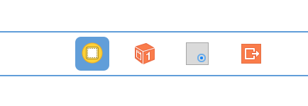
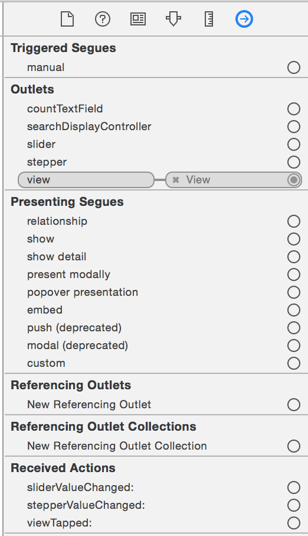

# Counter

For your first true iOS homework assignment at The Iron Yard, you will be building a simple counter app. It is capable of counting between 1 - 100. Simply follow the steps below and in the comments of the code and you'll have a fresh app ready to count in no time!

Be sure to have Xcode installed on your Mac before you try to open this project. To open the project, look in the project folder, called *Counter*, and click on the file called **Counter.xcodeproj**. Xcode will open and load the project. Once open, click on **Main.storyboard**. See the storyboard tasks below for the steps you need to complete. Then proceed to the code steps.

**NOTE:** this project as it is will not build and run in the iOS simulator. The reason is because there are several items missing from the code, and Xcode will not allow incomplete code to be built. You may notice a red icon at the top of the Xcode window with a number of errors listed. You will need to fix these errors before you can test the app, but if you follow the steps below, all the errors should disappear as you work through the checklist.

### Steps to Success

#### Storyboard Tasks

* [ ] Click the small yellow/orange circular button at the top of the view. This will select the view controller as the active object.

* [ ] Click the rightmost of the three buttons in the upper right corner of the Xcode window to open the inspector pane.

* [ ] Once the inspector is open, click on the *connections inspector* tab (it is the small circle with an arrow).

* [ ] Under Outlets, you should see names like *countTextField*, *slider*, and *stepper*. Go to the CounterViewController.m file and look in the @interface section. You should see properties with the same names. Go back to the storyboard and click and drag from the empty circle next to these names to their appropriate UI element in the storyboard view. You are *wiring up* your interface elements to their corresponding properties in code. This allows you to manipulate them in code. Once you connect these outlets to the UI elements in the view, the empty circles should fill in. You can also then hover your mouse over the outlet in the list and the associated element will be highlighted in the view.
* [ ] In the same tab (the connections inspector), there is another section labelled, *received actions*. There should be three names listed. Each of them are methods in the code that will run certain instructions. We need to connect them to the appropriate UI elements so when certain actions are taken by the user, these methods will be triggered. For *sliderValueChanged:* and *stepperValueChanged:*, simply drag from the empty circles to the appropriate UI element in the view. When you let go of the mouse over the element, several event types will appear. Take a guess which one to use.
* [ ] The third item under *received actions* is called *viewTapped:*. This is a method that will cause the keyboard to hide in the case where the user has tapped the textfield and edited the value. We need to connect it to something called a *gesture recognizer*. It does what you'd expect; it recognizes gestures. I've already set up a tap gesture recognizer that will fire whenever the main view is tapped. To wire it up to our method *viewTapped:*, simply drag from the empty circle to the top of our view where the four little icons are. The third icon from the left (the small grey square with a blue circle in the corner) is our gesture recognizer. Drag the line from the empty circle to this icon. It will blink and then the circle next to *viewTapped:* will be filled in.

Everything in our storyboard view is now properly wired up to the appropriate variables/methods in our code! When UI elements are touched by our user, the code in our view controller will be invoked.

#### Code Tasks

The following steps are numbered. You will find corresponding comments in the CounterViewController.m file with the same numbers.

* [ ] 1. Here you are *sending a message* to **self**. Self is the CounterViewController. Read the comment and try to figure out which method we should call here.
* [ ] 2. What variable should we use to update the textfield?
* [ ] 3. How about this slider?
* [ ] 4. And the stepper (detecting a pattern here)?
* [ ] 5.  What property of sender should we use (Big hint in the comment for this one)?
* [ ] 6. What method should we call here? And on what? 
* [ ] 7. This looks suspiciously similar. What goes in these blanks?
* [ ] 8. After we hide the keyboard and update the currentCount variable, what should we do?
